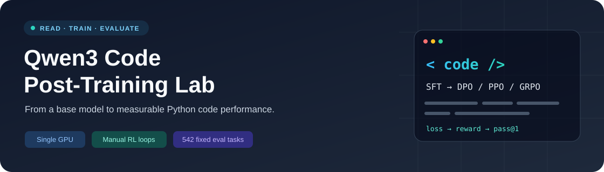
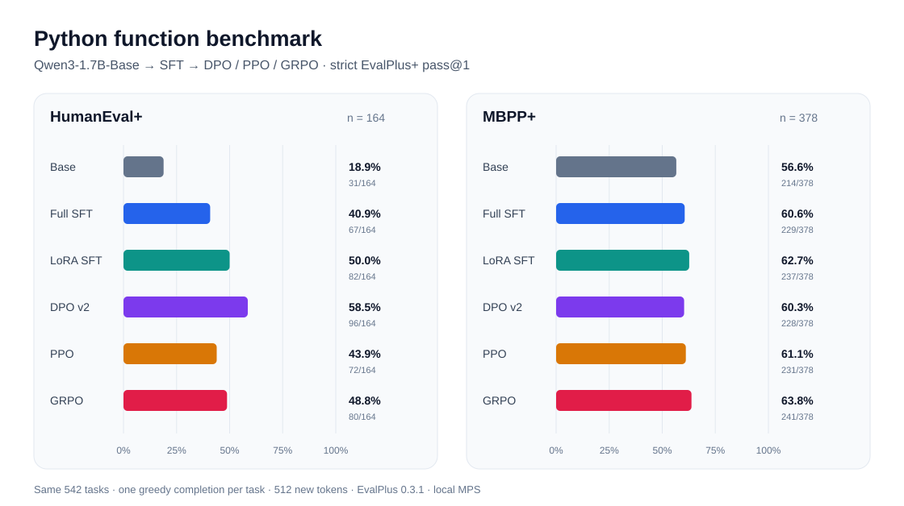
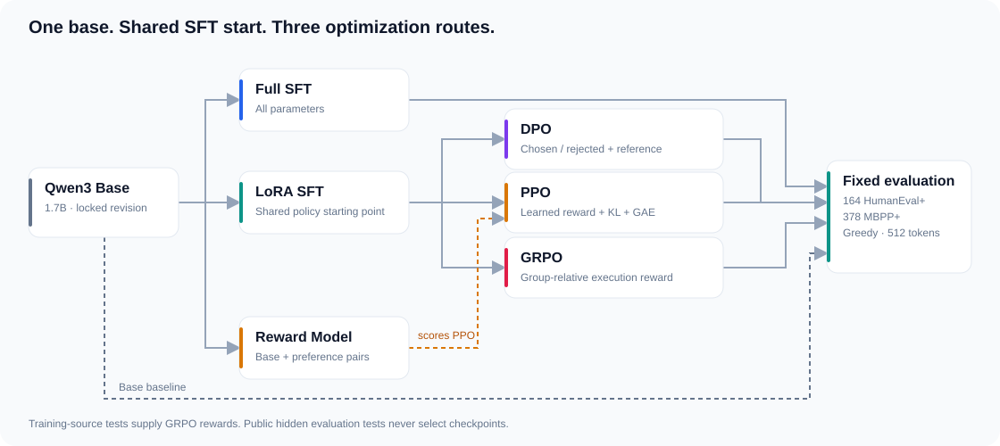

<a id="top"></a>
<div align="center">



# Qwen3 Code Post-Training Lab

**从 Base 到 SFT、DPO、PPO、GRPO：一个可读、可追溯的代码后训练学习项目**

A hands-on lab for Python code post-training with Qwen3-1.7B.

[](requirements.txt)
[](scripts/train_grpo.py)
[](#quickstart)
[](#results)
[](#models)

[实验结果](#results) · [快速开始](#quickstart) · [模型权重](#models) · [代码架构](#architecture) · [学习路线](#learning) · [文档导航](#docs)

</div>

---

基于 **Qwen/Qwen3-1.7B-Base**，在单张 RTX 4090 上完成 Full SFT、LoRA SFT、DPO、Reward Model + PPO 和 GRPO，再用同一套 Python 函数题评测。项目把数据格式、损失函数、采样、奖励和模型选择连成一条可读的实验链路，核心函数配有详细中文注释。

适合已经接触 Python / PyTorch、希望从真实代码理解大模型后训练的学习者。目前六阶段训练与评测已完成，最后核对日期：**2026-10-07**。项目定位是学习与实验；这里报告的通过率对应固定函数题与本次训练设置。

<a id="highlights"></a>
## ✨ 项目亮点

| | 可以在这里学到什么 |
| :--- | :--- |
| 🧠 **读懂训练目标** | 手写 PyTorch DPO / PPO / GRPO 循环与损失，跟踪概率、优势、梯度和参数更新。SFT 与奖励模型使用 TRL。 |
| 🧪 **让训练信号可检查** | 来源与 SHA-256 锁定；偏好对执行验证；GRPO 复测参考代码、题干示例、空实现和逻辑变异。 |
| 📊 **保留完整实验记录** | 六阶段分别保存原始代码、逐题判分和摘要；同一题集、同一解码参数，同时展示提升与退步。 |
| 🛠️ **理解单卡实现取舍** | LoRA、bf16、梯度检查点与梯度累积；GRPO 支持 GPU 服务器生成、Mac Docker 经 SSH 隧道判分。 |

<a id="results"></a>
## 📊 六阶段实验结果



**固定口径：** HumanEval+ 164 题 + MBPP+ 378 题 · 原始代码题干 · 每题一次贪心生成 · 最多 512 个新 token · EvalPlus 0.3.1 · 本地 MPS 生成 / Docker 判分。

| 模型 | HumanEval+ pass@1 | MBPP+ pass@1 |
| --- | ---: | ---: |
| [Base](results/base/20260922T010155Z/summary.json) | 31/164 · 18.9% | 214/378 · 56.6% |
| [Full SFT](results/full_sft/full-v1/summary.json) | 67/164 · 40.9% | 229/378 · 60.6% |
| [LoRA SFT](results/lora_sft/lora-v1/summary.json) | 82/164 · 50.0% | 237/378 · 62.7% |
| [DPO v2](results/dpo/dpo-v2/summary.json) | 96/164 · 58.5% | 228/378 · 60.3% |
| [PPO](results/ppo/ppo-v2/summary.json) | 72/164 · 43.9% | 231/378 · 61.1% |
| [GRPO](results/grpo/grpo-v1/summary.json) | 80/164 · 48.8% | 241/378 · 63.8% |

**如何解读这些结果：**

- **SFT 提升最明确。** LoRA SFT 相对 Base，HumanEval+ 从 18.90% 到 50.00%（+31.10 个百分点），MBPP+ 从 56.61% 到 62.70%（+6.08 个百分点）。
- **DPO v2 对两套题的影响不同。** 相对 LoRA SFT，HumanEval+ 多通过 14 题（+8.54 个百分点），MBPP+ 少通过 9 题（−2.38 个百分点）。
- **PPO / GRPO 仍有改进空间。** PPO 两套题均低于 LoRA SFT；GRPO 的 HumanEval+ 少通过 2 题（−1.22 个百分点），MBPP+ 多通过 4 题（+1.06 个百分点）。

这是各路线一次训练的观测，训练数据与预算也不同。小幅变化尚未经过多种子重复实验与显著性检验；结论边界见[实验限制](#limitations)。

[查看六阶段完整报告](results/comparisons/six-stage-grpo-v1/comparison.md) · [SFT 历史报告](docs/sft-comparison.md) · [DPO 错误分析](docs/dpo-error-analysis.md)

<details>
<summary><b>展开：原始测试通过率与计分说明</b></summary>

| 模型 | HumanEval 原始测试 | MBPP 原始测试 |
| --- | ---: | ---: |
| Base | 33/164 · 20.1% | 249/378 · 65.9% |
| Full SFT | 75/164 · 45.7% | 264/378 · 69.8% |
| LoRA SFT | 90/164 · 54.9% | 272/378 · 72.0% |
| DPO v2 | 100/164 · 61.0% | 265/378 · 70.1% |
| PPO | 78/164 · 47.6% | 268/378 · 70.9% |
| GRPO | 88/164 · 53.7% | 273/378 · 72.2% |

原始测试按逐题结果的 `base_status` 计数；带 `+` 的指标要求原始和增强测试同时通过，与 `summary.json` 一致。本文“百分点”表示通过率之差；相对增长率需另行计算。

GRPO 与 LoRA SFT 逐题配对：HumanEval+ 有 6 题从失败变通过、8 题从通过变失败；MBPP+ 分别为 6 题和 2 题。

</details>

<details>
<summary><b>展开：GRPO 训练预算、开发集轨迹与最佳模型</b></summary>

- `grpo-v1` 从原 LoRA SFT `lora-v1` 出发；冻结数据包含 2,005 道训练题、124 道开发题。本轮完成 200 组、每组 4 候选；96 组有奖励差异，104 组同分而跳过，累计 192 次参数更新。
- 4090 生成及更新，Mac Docker 经 SSH 隧道执行训练测试。采用学习率 `5e-6`、两遍组内更新、`beta=0`；没有额外 reference KL。训练记录总耗时 **10,165.23 秒（约 2 小时 49 分 25 秒）**，包括开发集评估、远程判分及保存，不等于纯 GPU 计算时间。
- 开发集全测试通过题数按第 0/50/100/150/200 组依次为 **79/79/77/81/78，分母均为 124**。`final_model` 取第 150 组（81/124），`last_model` 是第 200 组（78/124）；本次公开评测只使用预先由开发集选出的 `final_model`，没有按公开测试成绩挑权重。
- 最佳模型权重 SHA-256：`cc69fa849d7ac6f0ef8b7d3801fb6210c52bf16231b9b548097de7b62b0d32f7`。已核对它与 `checkpoints/best`、`checkpoints/group-150` 一致。训练记录保存在 `runs/grpo/grpo-v1/training_meta.json`，评测记录见[GRPO 摘要](results/grpo/grpo-v1/summary.json)。开发集曾用于 SFT 验证，开发集涨分不代表公开评测必然涨分。

</details>

<a id="quickstart"></a>
## 🚀 快速开始

**先选择入口：** 看结果无需 GPU；读代码从[学习路线](#learning)开始；复现训练需要一张支持 bf16 的 CUDA 卡；执行代码评测需要可用的 Docker。

**1. 获取项目与环境（CUDA 训练服务器）**

```bash
git clone https://github.com/lbw-work/qwen3-code-posttraining-lab.git
cd qwen3-code-posttraining-lab

conda create -n qwen-code python=3.11 -y
conda activate qwen-code

# 已验证的 CUDA 12.8 环境；其他驱动按实际兼容情况安装 PyTorch。
python -m pip install torch==2.8.0 --index-url https://download.pytorch.org/whl/cu128
python -m pip install -r requirements.txt
python -m pip install --no-deps -e .
export OMP_NUM_THREADS=4

python -m unittest discover -s tests -v
python scripts/check_project.py
```

`requirements.txt` 固定其余依赖版本，editable 安装启用 `src/qwen_posttrain` 公共包。当前冻结训练数据随仓库提供；Base 与后训练权重需单独准备；每个阶段的前置条件见[复现指南](docs/reproduction.md)。Mac 本地评测使用已有 MPS 环境，以上 CUDA 安装命令用于服务器。

**2. 下载锁定模型 / 准备训练输入**

```bash
# 按 models.lock.json 下载 Base 和官方参考模型。
python scripts/download_models.py

# 仓库已有 SFT / RL 数据时，不必重复构建。
# 首次复现 SFT 可选 full 或 lora，训练记录写入独立目录。
python scripts/train_sft.py --mode lora --run-id lora-reproduction-v1
```

也可从[模型权重](#models)下载已发布的 SFT 模型。DPO / PPO / GRPO 从同一 LoRA SFT 分叉；PPO 先训练奖励模型。冻结数据准备、各阶段命令和已有成果保护规则见[详细指南](docs/reproduction.md)。

**3. 完整评测：生成 → Docker 判分 → 汇总**

在支持 Docker 的机器上准备镜像；AutoDL GPU 服务器的 GRPO 奖励可用[Mac Docker 隧道方案](docs/grpo-mac-reward.md)。

```bash
docker build -f Dockerfile.eval -t qwen-code-eval:0.3.1 .

# 以下示例要求 models/base 已下载。
python scripts/generate_eval.py --stage base --model models/base --run-id base-reproduction-v1
python scripts/score_eval.py results/base/base-reproduction-v1
python scripts/summarize_eval.py results/base/base-reproduction-v1
```

每次实验使用新 `run-id`，脚本拒绝覆盖旧结果。`--limit` 仅用于生成冒烟检查；正式通过率必须完成全部 542 题。

<a id="models"></a>
## 🤗 模型权重

| 模型 | 模型卡与下载 | 加载方式 |
| --- | --- | --- |
| Full SFT `full-v1` | [Eternity5551/Qwen3-1.7B-Python-Code-Full-SFT](https://huggingface.co/Eternity5551/Qwen3-1.7B-Python-Code-Full-SFT) | 完整模型，Transformers 直接加载。 |
| LoRA SFT `lora-v1` | [Eternity5551/Qwen3-1.7B-Python-Code-LoRA-SFT](https://huggingface.co/Eternity5551/Qwen3-1.7B-Python-Code-LoRA-SFT) | 加载锁定 Base，再用 PEFT 叠加适配器。 |
| DPO v2 / PPO / GRPO | 本地已训练并评测，权重尚未发布 | 分别保留独立适配器与训练记录。 |

这些权重用于**原始 Python 代码续写**：输入与评测一致的函数题干。训练成绩不直接代表聊天、多轮交互或软件工程能力。

<details>
<summary><b>展开：已发布权重的固定 revision</b></summary>

- Full SFT：`aed510bf517353217c77e001b8f2940aa140da2d`
- LoRA SFT：`2f8982c3bebe1479f4834e246c98aa2dfecbc69e`

Base 的模型仓库、固定提交号和本地目录见 [`models.lock.json`](models.lock.json)。模型卡包含训练设置、评测口径、限制及最小推理示例。

</details>

<a id="architecture"></a>
## 🧩 架构与设计

源码按 **公共包 → 命令入口 → 冻结输入 → 独立结果 → 自动检查** 分层；完整目录职责和依赖方向见[架构与开发约定](docs/architecture.md)。现有 `python scripts/…` 命令保留，首次运行先执行 `python -m pip install --no-deps -e .`。



DPO、PPO、GRPO 的策略模型均从 **LoRA SFT `lora-v1`** 分叉。奖励模型独立从 Base 与偏好对训练，再为 PPO 打分。GRPO 从训练来源测试中获取执行奖励，公开评测隐藏测试不参与训练和检查点选择。

<details>
<summary><b>展开：数据、训练与评测的核心实现设计</b></summary>

### 数据：版本锁定与执行审核

| 代码入口 | 输入 → 输出 | 为什么这样设计 |
| --- | --- | --- |
| [`download_models.py`](scripts/download_models.py)、[`models.lock.json`](models.lock.json) | 官方模型 → 固定提交号的本地 Base / 参考模型 | 避免上游模型更新后，同一实验名对应不同权重。 |
| [`freeze_eval.py`](scripts/freeze_eval.py)、[`eval.lock.json`](eval.lock.json) | EvalPlus 官方题库 → `eval.jsonl` 与测试快照 | 训练前固定题目、版本和 SHA-256；训练处理只读取题干，不读取隐藏测试。 |
| [`prepare_sft.py`](scripts/prepare_sft.py) | OpenCodeInstruct → `data/sft/{train,valid}.jsonl` | 只保留测试全过、可解析且含函数的 Python 代码；按题干去重，排除与评测题干明显重合的样本。输出 `prompt` / `completion` 两列。 |
| [`prepare_rl.py`](scripts/prepare_rl.py) | SFT 来源记录 → `data/rl/{train,valid}.jsonl` | 保留训练题自带的 `tests`，供 GRPO 算执行奖励；不使用公开评测的隐藏测试。 |
| [`prepare_grpo.py`](scripts/prepare_grpo.py) → [`audit_grpo_data.py`](scripts/audit_grpo_data.py) | SFT/RL 原划分 → `data/grpo/{train,valid}.jsonl` | 排除超长和不完整函数题，Docker 复测参考答案、空实现、恒零探针、题干示例及逻辑变异；保留溯源与质量报告。 |
| [`export_verified_preference.py`](scripts/export_verified_preference.py) → [`audit_preference_examples.py`](scripts/audit_preference_examples.py) → [`prepare_preference.py`](scripts/prepare_preference.py) | OpenCodeInstruct 函数答案与训练测试 → 执行验证的 `prompt` / `chosen` / `rejected` | v2 本地冻结训练 3,212 对、验证 153 对；DPO 与奖励模型共用。正例全过，负例通过至少一半但未全过原测试；可解析题干示例不一致者被排除。 |
| [`prepare_ppo.py`](scripts/prepare_ppo.py) | 冻结偏好题干 + 原 RL 来源 → `data/ppo/{train,valid}.jsonl` | 与 DPO/RM 使用同源函数题；排除会被 PPO 512 token 上限截断的 11 道题。训练 3,201 道、验证 153 道。 |

所有处理后的数据都有对应 `*.lock.json`，记录源版本、输出哈希与评测版本。脚本发现已存在的冻结输出时会停止，防止重跑悄悄覆盖实验输入。

### 训练：不同目标，共同起点

| 阶段与入口 | 读入什么 | 训练目标与产物 | 当前状态 |
| --- | --- | --- | --- |
| [`train_sft.py`](scripts/train_sft.py) `--mode full/lora` | 同一份 SFT `prompt` / `completion`、锁定 Base | 只对代码答案计算交叉熵：题干 token 的标签为 `-100`。Full 更新全部参数；LoRA 只更新低秩矩阵。各自保存 `final_model/` 和 `training_meta.json`。 | 已在 4090 训练并完整评测 |
| [`train_dpo.py`](scripts/train_dpo.py) | LoRA SFT、`chosen` / `rejected` | 比较同一题两份答案在可训练策略和冻结参考策略下的对数概率，直接优化偏好差；手写 PyTorch 损失。 | `dpo-v2` 已训练并完整评测 |
| [`train_reward.py`](scripts/train_reward.py) → [`train_ppo.py`](scripts/train_ppo.py) | 偏好对训练的奖励模型、LoRA SFT、PPO 函数题干 | 奖励模型先学习给答案打分；PPO 再采样回答，用缩放后的奖励、KL、GAE、裁剪损失更新 LoRA 与价值头。PPO 循环自行实现。 | 奖励模型 `reward-v2`、PPO `ppo-v2` 已训练；PPO 已完整评测 |
| [`train_grpo.py`](scripts/train_grpo.py) + [`code_reward.py`](scripts/code_reward.py) | LoRA SFT、冻结 GRPO 题干及训练测试 | 每题采样 4 份代码，以 Docker 测试比例算组内优势；同分组跳过；开发集选择 best，同时保留 last 和逐题候选。 | `grpo-v1` 已在 4090 训练并完整评测 |

[`train_common.py`](scripts/train_common.py) 负责后续阶段共用的运行目录、锁文件校验与适配器路径检查。DPO、PPO、GRPO 都从**同一份 LoRA SFT** 分叉，便于比较三种偏好优化路线；六阶段结果均已完成并保留独立记录。

### 评测：生成与执行隔离

```text
eval.jsonl + 模型
  → generate_eval.py       只生成代码，保存原始 completion
  → score_eval.py          在禁网、限资源 Docker 内运行 EvalPlus 测试
  → summarize_eval.py      校验题目数和判分哈希，计算各阶段 pass@1
  → compare_eval.py        六阶段完成后再生成最终横向对比
```

[`generate_eval.py`](scripts/generate_eval.py) 对完整模型直接加载权重，对 LoRA 自动加载锁定 Base 再叠加适配器。它不执行生成代码；[`score_eval.py`](scripts/score_eval.py) 才把代码交给 Docker。两套公开题始终使用同一原始 prompt、贪心解码、每题一次生成和最多 512 个新 token。按阶段保存原始输出、逐题判分、配置与摘要，避免只留下一个无法追溯的总分。


</details>

<a id="data"></a>
## 🗂️ 数据与可复现记录

数据来源为固定版本的 [NVIDIA OpenCodeInstruct](https://huggingface.co/datasets/nvidia/OpenCodeInstruct)，许可证为 [CC BY 4.0](https://creativecommons.org/licenses/by/4.0/)。SFT 使用原始第一份 100,000 行分片筛选，来源提交、分片与输出哈希由锁文件追溯。

| 用途 | 训练 / 验证或开发 | 训练信号 | 查看格式与审核 |
| --- | ---: | --- | --- |
| Full / LoRA SFT | 26,805 / 1,386 | `prompt` + 正确代码 `completion` | [数据样例](data/examples/README.md) |
| DPO v2 / Reward Model | 3,212 / 153 对 | 全过正例与部分通过负例；负例来自逻辑变异 | [执行验证说明](docs/verified-preference-data.md) · [10 对样例](docs/preference-examples.md) |
| PPO | 3,201 / 153 题 | 题干采样 + 学习得到的奖励模型分数 | [PPO 数据说明](docs/ppo-data.md) |
| GRPO | 2,005 / 124 题 | 每题 4 份真实代码的训练测试通过比例 | [GRPO 数据审核](docs/grpo-training.md) · [10 道样例](docs/grpo-data-examples.md) |
| 公开评测 | HumanEval 164 + MBPP 378 | 原始测试与增强测试的 pass@1 | [`eval.lock.json`](eval.lock.json) |

`*.lock.json` 固定输入版本；`training_meta.json` 记录实际训练；`config.json`、原始生成代码、逐题判分与 `summary.json` 留在各自运行目录。公开仓库不包含 Base 权重、原始 Parquet 或全部本地训练产物；当前偏好 v2、PPO、GRPO 数据及对应锁文件均随仓库提供。各训练阶段的原始元数据副本见 `results/<stage>/<run-id>/training_meta.json`。

<a id="learning"></a>
## 📚 建议学习路线

| 顺序 | 从哪里读 | 读完应能解释 |
| --- | --- | --- |
| ① 固定评测 | [`freeze_eval.py`](scripts/freeze_eval.py) → [`eval.jsonl`](eval.jsonl) | 如何保证不同模型回答同一套题。 |
| ② 数据到 token | [`prepare_sft.py`](scripts/prepare_sft.py) → [处理后样例](data/examples/) | 一条记录如何变成题干与代码答案。 |
| ③ 公共实现与 SFT | [`artifacts.py`](src/qwen_posttrain/artifacts.py) → [`train_sft.py`](scripts/train_sft.py) | 标签 `-100`、答案 loss、参数更新范围、最佳模型选择。 |
| ④ 生成与判分 | [`generate_eval.py`](scripts/generate_eval.py) → [`score_eval.py`](scripts/score_eval.py) → [`summarize_eval.py`](scripts/summarize_eval.py) | 原始 completion 怎样变成逐题结果和 pass@1。 |
| ⑤ DPO | [`prepare_preference.py`](scripts/prepare_preference.py) → [`train_dpo.py`](scripts/train_dpo.py) | chosen/rejected、冻结 reference 与概率差。 |
| ⑥ Reward + PPO | [`policy.py`](src/qwen_posttrain/policy.py) → [`train_reward.py`](scripts/train_reward.py) → [`train_ppo.py`](scripts/train_ppo.py) | reward、KL、GAE、value loss 与策略裁剪。 |
| ⑦ GRPO | [`train_grpo.py`](scripts/train_grpo.py) → [`code_reward.py`](scripts/code_reward.py) | 组内标准化、同分零更新、固定旧概率与执行奖励。 |

<a id="docs"></a>
## 🧭 文档导航

| 想做什么 | 文档 |
| --- | --- |
| 理解目录、依赖与发布规则 | [架构与开发约定](docs/architecture.md) · [本次清理清单](docs/repository-cleanup.md) |
| 安装环境、准备数据、复现各阶段 | [实验复现与阶段命令](docs/reproduction.md) |
| 查看原 SFT 训练和评测细节 | [SFT 历史报告](docs/sft-comparison.md) |
| 检查偏好数据和 DPO 的退步原因 | [偏好数据审核](docs/dpo-data-audit.md) · [DPO 错误分析](docs/dpo-error-analysis.md) |
| 准备 PPO 数据 | [PPO 数据说明](docs/ppo-data.md) |
| 准备 GRPO、看本地验收证据 | [GRPO 指南](docs/grpo-training.md) · [本地验收记录](docs/grpo-local-validation.json) |
| AutoDL GPU + Mac Docker 远程奖励 | [跨机判分与 tmux 指令](docs/grpo-mac-reward.md) |
| 查看六阶段最终通过率 | [六阶段对比报告](results/comparisons/six-stage-grpo-v1/comparison.md) |

<a id="limitations"></a>
## 🔎 实验限制与下一步

- **泛化与数据重合。** 连续词、函数名与实现去重只能降低明显重合，无法排除所有语义近似题。独立自建复核题尚未加入。
- **开发集来源。** GRPO 开发题曾用于 SFT 验证；偏好 valid 的题曾用于 SFT train。开发集和验证 loss 不等同于新题泛化成绩。
- **评测环境。** 当前标准答案自检为 HumanEval+ 163/164、MBPP+ 377/378；HumanEval/32、Mbpp/255 的题库标准答案也未通过当前测试。各模型仍按完整分母报告。
- **算法与预算。** DPO / PPO / GRPO 数据和训练预算不同；简化 GRPO 的 `beta=0`，裁剪不保证真实 KL 有界。小幅成绩变化需多种子重复验证。
- **运行恢复。** 当前 GRPO 未保存完整优化器和随机状态，不支持严格断点续训。远程奖励服务或隧道故障会报错停止，不能被记成零奖励。

后续优先补充独立开发题与重复实验，再排查奖励噪声、有效组比例和模型退步题型；扩大训练预算前先完善断点恢复。

<a id="references"></a>
## 🤝 参考与致谢

底座来自 [Qwen3](https://github.com/QwenLM/Qwen3)，训练数据来自 [OpenCodeInstruct](https://huggingface.co/datasets/nvidia/OpenCodeInstruct)，评测使用 [EvalPlus](https://github.com/evalplus/evalplus)，SFT / 奖励模型依赖 [TRL](https://github.com/huggingface/trl)。

学习更多训练实现可参考 [LlamaFactory](https://github.com/hiyouga/LlamaFactory)、[OpenRLHF](https://github.com/OpenRLHF/OpenRLHF) 与 [TRL](https://github.com/huggingface/trl)。本项目首页采用清晰导航、快速开始和分层文档的组织方式，便于从结果进入代码。

如果发现样例错配、评测异常或复现问题，欢迎通过 [Issues](https://github.com/lbw-work/qwen3-code-posttraining-lab/issues) 提供运行编号、环境和最小复现。反馈时请隐藏密码与访问令牌。

<p align="center"><a href="#top">↑ 返回顶部</a></p>
